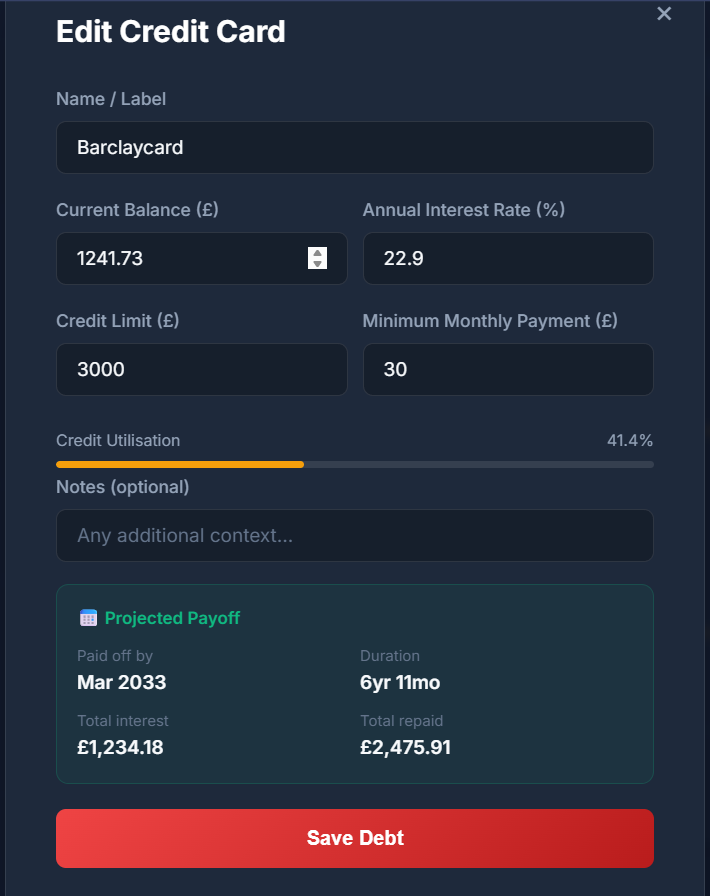

I used Antigravity IDE which used both Gemini 3.1 and Claude 4.6.

I used this prompt to generate the debt tracking feature:

```text
The next feature is debt tracking, similar to the previous asset tracking feature.

It should follow this criteria:
"Student Loans: * Calculations based on plan types (e.g., Plan 2 interest rate variations).
Integration of automatic interest accrual logic.
General Debt: Tracking for credit cards, personal loans, and mortgages, including interest rates and minimum monthly payments."

the user should be able to edit, delete and create debts. the value should also be able to be tracked historically and allow for future expansion of dashboards and predictive modeling.

Handle input validation accordingly, for instance you should not be able to have a negative debt.

Add any additional features for debt tracking that would be expected of this type of application I have not explicitly mentioned
"
```

This failed repeatedly, returning the following error message:

```json
{
  "error": {
    "code": 503,
    "details": [
      {
        "@type": "type.googleapis.com/google.rpc.ErrorInfo",
        "domain": "cloudcode-pa.googleapis.com",
        "metadata": {
          "model": "gemini-3.1-pro-high"
        },
        "reason": "MODEL_CAPACITY_EXHAUSTED"
      },
      {
        "@type": "type.googleapis.com/google.rpc.RetryInfo",
        "retryDelay": "6s"
      }
    ],
    "message": "No capacity available for model gemini-3.1-pro-high on the server",
    "status": "UNAVAILABLE"
  }
}
```

This isn't out of the ordinary when sending requests to an AI api, however, this was the first prompt I had sent in over a week. I attempted to switch to the Claude 4.6 only version of Antigravity, but this also returned an error regarding token useage.

Since I know I have not used any tokens in a long period of time, I can only assume that the project data it is attempting to send is too large for it to process, resulting in constant server errors. This is worrying as the codebase is not exactly large, so when more advanced features are added, it may run into further issues.

It took several attempts, but it finnally worked through it. It added the expected features, but to a higher standard than I expected. For instance, it has included a notes section and predictions of when the debt will be paid off based on the current information:



It also added in the history page for assets as well, which was only a json popup previously.
